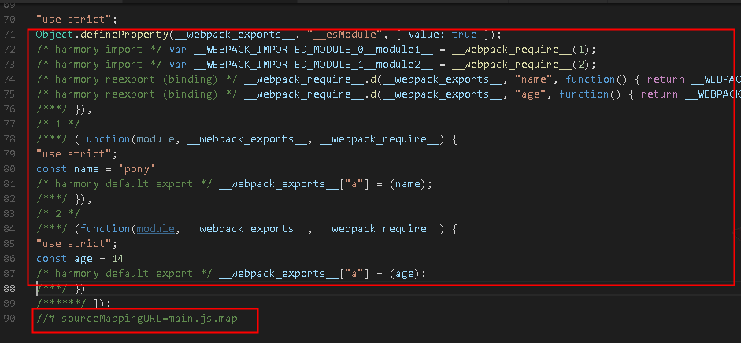

# devtool最佳实践
## 目录
[TOC]
## 简介

<!-- 
1.阐述devtool的作用,webpack默认使用的devtool，其对devtool字段的解释
2.理清source和map之间的关系 
-->
> devtool参数决定了你的source maps是按何种方式输出出来的。

## devtool的类型

> webpack中的sourcemap各个配置项异同乍看之下各个配置项很难记忆， 但其实从每个关键字所代表的特性入手， 就能体会到他们的异同。他们在webpack中的主要区别一个体现在重构的性能上， 总的来说 <b>eval性能最好，source-map性能最低</b> ，但就我自身的实践来看大多用的是最完整的source-map，该模式对于不管是js还是css，scss等都能很好的覆盖， 相反其他模式都不完整， 在开发环境下重构性能似乎比不上功能的完善。另外需要补充的是module关键字， 当加上module关键字webpack将会添加loader的sourcemap

类型|描述|优势|劣势|
--|--|--|--|--
eval|使用eval包裹模块代码|代码打包速度快|文件压缩比例小|
source-map|产生.map文件||||
cheap|不包含代码和loader列信息的sourcemap|map文件相较于source-map小|断点错误信息时，只能到代码行|
module|包含loader的sourcemap||||
inline|将.map作为DataURI嵌入，不单独生成.map文件||js文件打包过大|

> **提问：默认配置是否是最优的配置？**

模式|解释
--|--
eval|每个 module 会封装到 eval 里包裹起来执行，并且会在末尾追加注释 //@ sourceURL.
eval-source-map|每个 module 会通过 eval() 来执行，并且生成一个 DataUrl 形式的 SourceMap .
cheap-module-source-map|生成一个没有列信息（column-mappings）的 SourceMaps 文件，同时 loader 的 sourcemap 也被简化为只包含对应行的。
cheap-source-map|生成一个没有列信息（column-mappings）的 SourceMaps 文件，不包含 loader 的 sourcemap（譬如 babel 的 sourcemap）
source-map|生成一个 SourceMap 文件.
hidden-source-map|和 source-map 一样，但不会在 bundle 末尾追加注释.
inline-source-map|生成一个 DataUrl 形式的 SourceMap 文件.

### 1.eval

> js文件4k

  文件上

### 2.eval-source-map

> js文件6k

### 3.source-map

> js文件4k，map文件4k
 

### 4.cheap-source-map

> js文件4k，map文件4k

### 5.cheap-module-source-map

> js文件4K，map文件4k（理论上map更小，but没体现）

### 6.hidden-source-map

> js文件4k，map文件4k

### 7.inline-source-map

> js文件8k

## 功能实现

//TODO 阐述webpack上对于devtool是如何实现的

## 项目经验

<!-- 
分享一下为数不多的项目经验
1.最好是结合之前的项目经验，输出数据性的文字
 -->
> 组内有一使用webpack1.* + angular1.*的项目，属于早期组内自行摸索的前端脚手架。
> - 优化前
>   - 线上打包
>     - eval(15s左右) 
>     - eval-source-map(26s左右) 
>     - source-map(32s左右) 
> - 优化后
>   - 线上打包 
>     - cheap-source-map(32s左右) 

## 版本差异

//TODO devtool在webpack的各个版本中的差异点梳理

## 总结
> 正确的打包方式，带来的将是代码包结构上开发调试效率的提升

## 参考文档

[《webpack官方技术文档》](https://webpack.js.org/configuration/devtool/)

[《devtool里的7种SourceMap模式》](https://juejin.im/post/58293502a0bb9f005767ba2f)

[《打破砂锅问到底：详解Webpack中的sourcemap》](https://segmentfault.com/a/1190000008315937)

